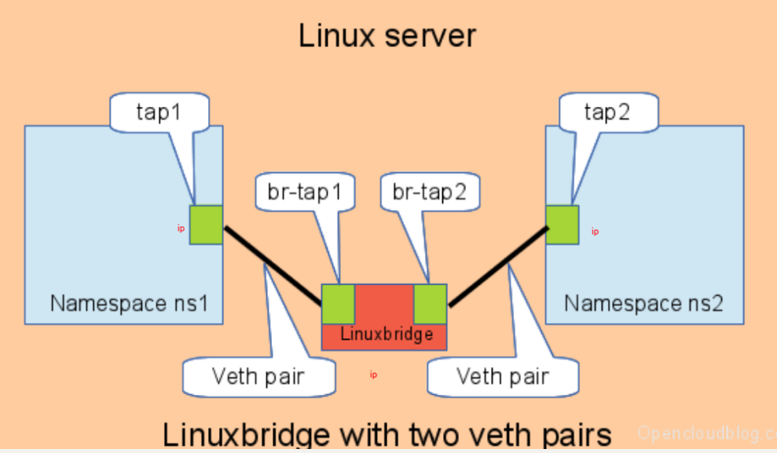

# Docker-Demo

  This Project is a demo of docker which uses Linux cgroup and namespace. It's useful for me to study the principle of docker.  

# Config

```json
{
  "ContainerId": "con-1",
  "RootFs": "/home/yy/coursa/lab/docker/code/Pro_3/root/rootfs",
//根文件系统
  "HostName": "htest",
//主机名
  "NetNs": "n3",
//创建后所处的网络命名空间名称
  "VolumeFrom": "/home/yy/coursa/lab/docker/code/Pro_3/volumn/soft_link",
//支持挂载，主机的地址    
  "VolumeTo": "/tmp/data",
//根文件系统的地址
  "Mode": "RW",
//挂载权限
  "SrcPort":5000,
  "DstPort": 8888,
  "IpNet":"10.0.41.2/24",
   //容器的IP地址
  "GateWay": "10.0.41.1"
   //bridge的IP地址
}
```

# NetWork



​	Use veth pair and bridge to construct container network,as described in network/netconfig.go.

​	You should design the network the subnet using by docker.Such as:

```
Getway:10.0.41.1
Subnet:10.0.41.0/24 
```

# Namespace 

Use three flags **CLONE_NEWNS**,**CLONE_NEWPID**,**CLONE_NEWUTS**.

# Usage

First,write a correct configure file. Pay attention to the IP address configuartion.

Then run the following commands:

Host: Open the Nat.

```sh
iptables \
	-t nat \
	-A POSTROUTING \
	-s $GatewayIp/CIDR \ 
	-j MASQUERADE
```

```sh
go build 
sudo ./gocontr run xxx.json /bin/bash
```

docker:

```sh
# you should run the following command in the docker to make sure network normal.
sudo ip route add default via $GatewayIp
# ping 182.61.200.6(www.baidu.com)
```

# After exit from docker

​	When you exit from the docker,you should notice the two changes have happened in your host.

​	First,you mount will not be deleted.And the new veth pair and other network devices will be add.

​	You can run the following commands to redo.

```sh
# delete linux network
sudo ip netns delete $namespace
sudo ip link delete $veth-pair-name

# delete mount
sudo umount $dir
```


​	
