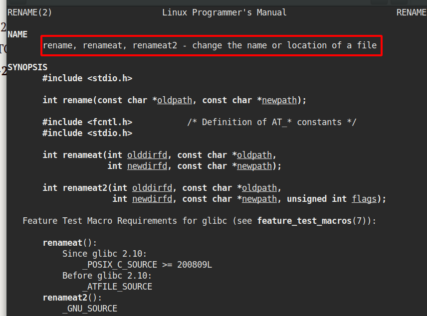

# CVE-2021-25741

​	是CVE-2017-1002101漏洞中的修复策略：

​	借助路径检查和类似“锁”的机制，确保恶意用户通过subPath挂载的路径不是非预期的符号链接。然而，百密一疏，纵使官方的修复方案已经考虑了种种情况，但最后的挂载操作是由系统上的`mount`工具执行，而该工具默认解析符号链接，这就引入了TOCTOU问题（竞态条件问题的一种），也就是近来曝光的CVE-2021-25741。

# TOCTOU问题

time of checko time of use 问题

​	In [software development](https://en.wikipedia.org/wiki/Software_development), **time-of-check to time-of-use** (**TOCTOU**, **TOCTTOU** or **TOC/TOU**) is a class of [software bugs](https://en.wikipedia.org/wiki/Software_bug) caused by a [race condition](https://en.wikipedia.org/wiki/Race_condition) involving the *checking* of the state of a part of a system (such as a security credential) and the *use* of the results of that check.

​	竞争条件引起的，如果两个程序并行运行，可能会出现check和use实际是不同的两个对象的情况。

# CVE-2017的修复策略

1、在宿主机上对所有subpath进行解析

2、依次打开每个路径段，确保当前路径位于卷内部

3、mount挂载

# 利用手段

​	根据Linux手册[17]，`mount`工具默认情况下是解析符号链接的。因此，虽然前述补丁过程中攻击者无法做些什么，可以在`mount`工具解析符号链接后和挂载操作执行前制造竞态条件攻击，从而绕过前述补丁的防御措施。

​	思考可以使用rename系统调用



不断变更文件名

```
subpath1: /安全路径
subpath2: /危险路径 
```

​	不断变更两者文件名，可以在中间制造机会，使用subpath1的路径进行安全检查，使用subpath2的路径进行mount。